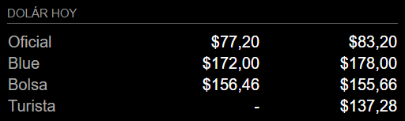

# MMM-CurrencyArg
### Descripoción
Modulo de MagicMirror que muestra las cotizaciones de los distintos dolares argentinos en tiempo real.
### Config
|Propiedad|Descripcion|Default|
|------|-------|------|
|header|Titulo del encabezado|Dolár hoy|
|url|Url de la api de donde se van a obtener las cotizaciones|https://www.dolarsi.com/api/api.php?type=valoresprincipales|
|types|Tipos de dolares a mostrar. Valores posibles: ['oficial', 'blue', 'soja', 'contado con liqui', 'bolsa', 'bitcoin', 'turista']|['oficial', 'blue', 'bolsa', 'turista']|

### Demo

 
